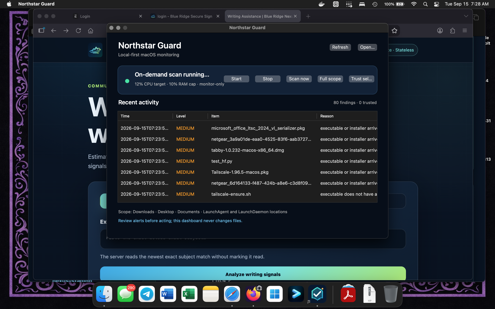

# Northstar Guard for macOS

Northstar Guard is a lightweight, clean-room macOS monitor built with Objective-C, Foundation, AppKit, and the macOS Security framework. It is not a copy of NETGEAR Armor, Bitdefender, ClamAV, or another commercial antivirus product.




## What it does

- Runs as a per-user macOS LaunchAgent, so monitoring continues when the dashboard is closed.
- Provides native dashboard controls to start or stop monitoring and request a focused or full configured-scope scan.
- Uses a 12% average CPU target, reduced process priority, and a 10% physical-memory high-water limit.
- Creates timestamped Markdown reports with an executive summary, coverage, findings, recommendations, and data gaps.
- Lets you select an alert and mark it as a trusted known-good item; trusted paths are excluded from future alerts and counted in reports.
- Never deletes, quarantines, or uploads scanned files.

## Trusted known-good findings

Select a finding in the dashboard and choose **Trust selected** only after independently confirming that the item is expected and safe. Northstar Guard records the path, original finding context, and trust time in `~/Library/Application Support/NorthstarGuard/trusted-known-good.json`.

Trusted items are hidden from the dashboard’s active findings and skipped by future scans. This is a local allow-list, not a security verdict; review it carefully and remove an entry from that JSON file if the file changes ownership or purpose.

## Scan coverage

The live monitor performs a paced pass every 60 seconds and examines up to 250 entries per pass. It monitors these high-risk locations:

- `~/Downloads`, `~/Desktop`, and `~/Documents`
- `~/Library/LaunchAgents`
- `/Library/LaunchAgents` and `/Library/LaunchDaemons`

A focused scan covers the user-facing locations. A full-scope scan covers all configured locations above; it does not crawl the whole disk. Hidden paths, package descendants, and files larger than 512 MiB are excluded.

## Detection engines

Northstar Guard uses local, evidence-based checks:

1. Downloaded executable and installer detection in `Downloads`.
2. Misleading double-extension detection.
3. macOS code-signature validation through the Security framework.

These are alerts for review, not malware verdicts. Northstar Guard does not bundle ClamAV signatures or a commercial signature engine.

## Install

Install Apple Command Line Tools if necessary:

```zsh
xcode-select --install
```

Then clone this repository and run:

```zsh
chmod +x macOS-Northstar-AV/install-northstar-guard.sh
./macOS-Northstar-AV/install-northstar-guard.sh
```

By default, reports are written to `~/NorthstarGuardReports`. To choose another local report location:

```zsh
./macOS-Northstar-AV/install-northstar-guard.sh --reports-dir "$HOME/SecurityReports/NorthstarGuard"
```

After installation, open `~/Applications/Northstar Guard.app`. Quitting that window does not stop the background LaunchAgent; use the dashboard’s **Stop** control to pause monitoring.
